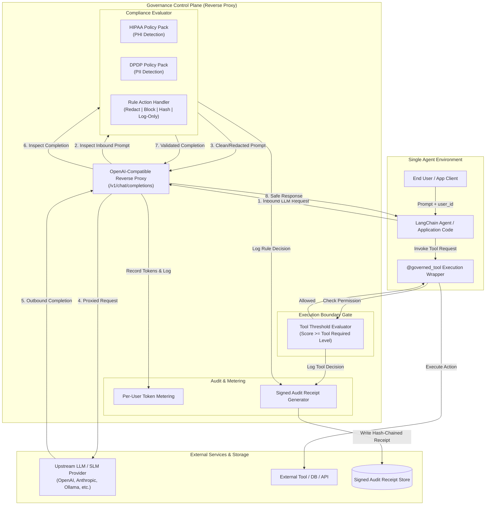
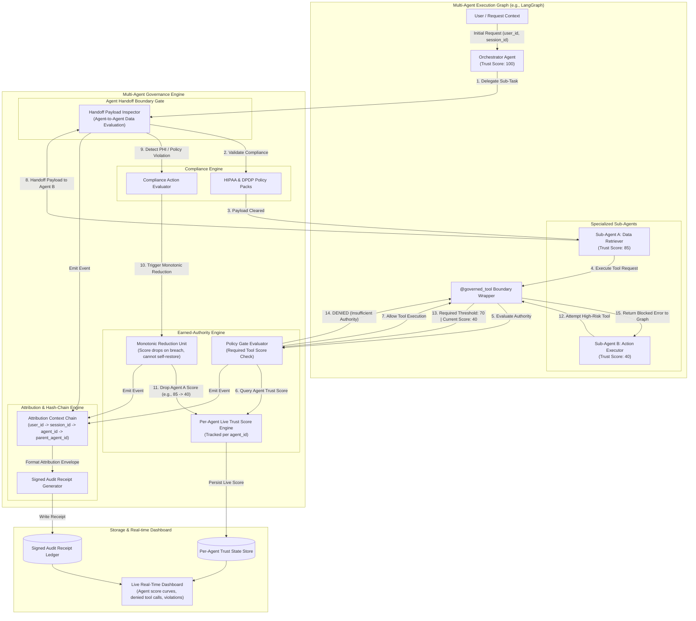

# System Architecture: LLM/SLM Governance Runtime

This document details the system architecture split into two core operational setups:
1. **Single LLM / Single-Agent Architecture** (OpenAI-compatible Reverse Proxy & Direct Interception)
2. **Multi-Agent / Multi-LLM Architecture** (LangGraph Flow, Per-Agent Authority, and Handoff Gates)

---

## 1. Single LLM / Single-Agent Setup

In a single-agent scenario (e.g., direct Claude/GPT client or single LangChain agent), the runtime operates as an OpenAI-compatible reverse proxy sitting between the agent client and the upstream LLM provider, combined with wrapper gates for local tool execution.

---

## 2. Multi-Agent / Multi-LLM Setup

In a multi-agent graph (e.g., LangGraph with orchestrators and specialized sub-agents), full network transparency is insufficient. The governance runtime attaches directly to framework hooks to evaluate **per-agent compliance**, manage **live trust scores**, enforce **monotonic reduction**, and govern **agent-to-agent handoffs**.

---

## 3. Comparison of Setups

| Aspect | Single LLM / Single-Agent Setup | Multi-Agent / Multi-LLM Setup |
| :--- | :--- | :--- |
| **Primary Interception Point** | OpenAI-compatible Reverse Proxy (`/v1/chat/completions`) | Framework Callbacks / LangGraph State Hooks + `@governed_tool` |
| **Attribution Scope** | `user_id` $\rightarrow$ `session_id` | `user_id` $\rightarrow$ `session_id` $\rightarrow$ `agent_id` $\rightarrow$ `parent_agent_id` |
| **Authority Tracking** | Single session score baseline | Distinct live trust scores per `agent_id` within the session |
| **Handoff Inspection** | N/A (Single agent flow) | Intercepts agent-to-agent payload transfers before receiver execution |
| **Score Penalty Model** | Input/output compliance penalization | Monotonic reduction per specific offending agent |
| **Tool Gating** | Pre-tool check on global session score | Pre-tool check against specific acting `agent_id`'s trust score |
